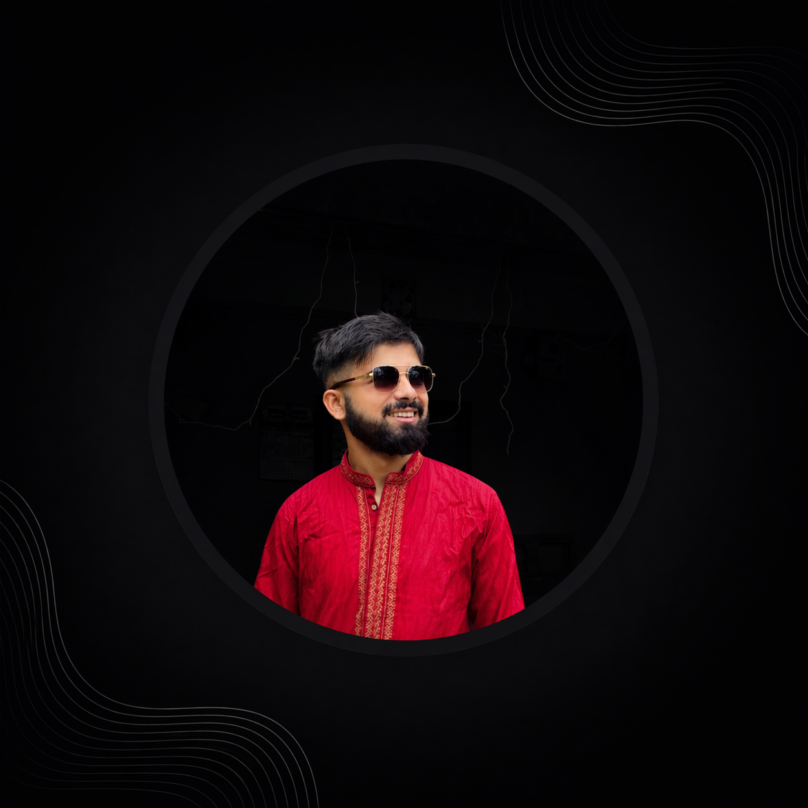

  
  
  <h1>Hi there, I'm Keshav Dahal 👋</h1>
  
  

    
  

  

    
  

  

---

## 🙋‍♂️ About Me

- 🎓 Bachelor's Graduate in Computer Science from Nepal
- 🔭 Currently learning **Flutter**
- 💼 Currently intern at **Neutrotex**
- 🌱 Exploring **GitHub Copilot** & AI-powered development
- 👯 Open to collaborate on exciting projects
- 💬 Ask me about **React.js, Tailwind CSS, HTML, CSS**
- 📫 Reach me at **keshabdahal008@gmail.com**

---

## 🌐 Connect With Me

---

## 🛠️ Languages & Tools

  

---

## 📊 GitHub Stats

  
  

  

---

  

